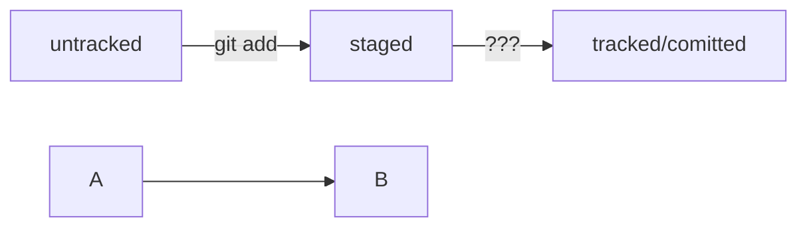

# Прежде чем начать изучать GIT, оцени свои знания и  необходимость это делать

Если в твоей практике был опыт работы с Linux, MacOS можешь смело

приступать к изучению GIT. Тебе будет легко освоить принципы

работы с системой контроля версий.

## Инструкция по созданию репозитория, при условии что GIT установлен

1. С помощью комманды 

```
mkdir %имя репозитория%
```

создаем каталог локального репозитория

2. С помощью комманды 

```
touch %имя файла%.txt
```

создаем файл в локальном репозитории

3. Выполняем комманду **git add --all** , чтобы гит начал отслеживать изменения в файле

4. Проверяем статус  с помощью комманды **git status**, и если все ОК, двигаемся дальше

5. Выполняем коммит с помощью коммманды __git commit -m 'комментарий'__ 

6. Выполняем команду **git push**

7. Заходим через браузер и смотрим что получилось в [GitHUB](https://github.com) 

